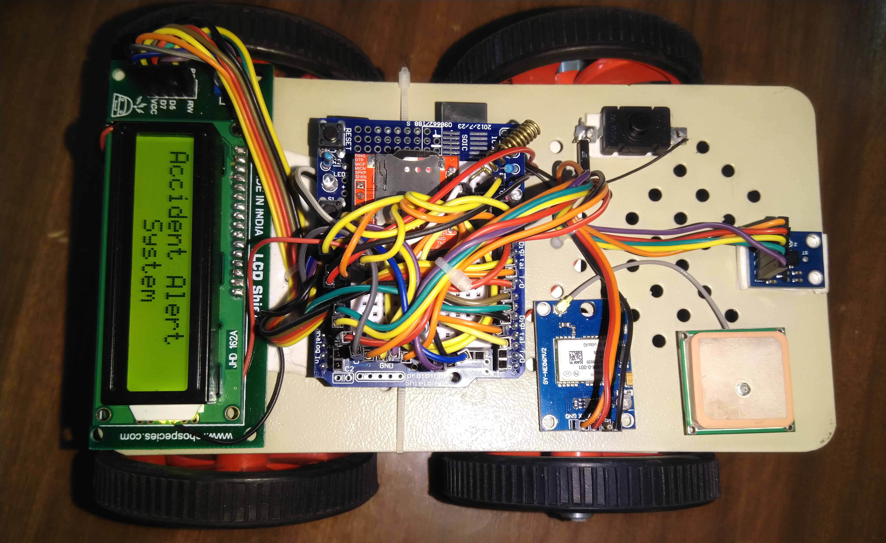

# 🚗 Vehicle Crash Detection & Alert System 🚨



Welcome to the *Vehicle Crash Detection & Alert System* — an intelligent, Arduino-based project designed to automatically detect a vehicle accident and send immediate alerts, including the precise location, to emergency contacts. By leveraging a suite of sensors and a robust state-machine architecture, this system aims to reduce emergency response times and enhance road safety.

---

## 🌟 Key Features

-   💥 **Automatic Impact Detection:** Uses an accelerometer to sense sudden shocks and impacts characteristic of a crash.
-   ⏳ **30-Second Countdown Timer:** After an impact is detected, a 30-second countdown begins, giving the driver a chance to cancel the alert.
-   🔕 **False Alarm Cancellation:** A simple push-button allows the user to cancel the emergency alert during the countdown, preventing false alarms.
-   🔊 **Audible & Visual Alerts:** A buzzer and a 16x2 I2C LCD provide clear, real-time feedback about the system's status, including the alert countdown.
-   📡 **Real-Time GPS Tracking:** A NEO-6M GPS module pinpoints the vehicle's exact location.
-   📲 **GSM Alert System:** A SIM800L module automatically sends an SMS with a Google Maps link to the location and places a voice call to a pre-defined emergency number.
-   📞 **Remote Location Request:** The emergency contact can text "get gps" to the device at any time to receive its current location.
-   🧠 **Robust State-Machine Logic:** The code is built around a clean and reliable state machine (`IDLE`, `COUNTDOWN`, `ALERTING`), ensuring predictable and stable operation.

---

## 🛠 Hardware Components

| Component                   | Model/Type             | Purpose                                            |
| --------------------------- | ---------------------- | -------------------------------------------------- |
| **Microcontroller**         | Arduino UNO/Nano       | The brain of the system.                           |
| **GSM Module**              | SIM800L                | For making calls and sending SMS alerts.           |
| **GPS Module**              | NEO-6M                 | To get precise geographic coordinates.             |
| **Accelerometer**           | ADXL335 (3-Axis)       | To detect the impact of a crash.                   |
| **Display**                 | 16x2 I2C LCD Display   | To show system status and the countdown timer.     |
| **Input**                   | Push Button            | To cancel a false alarm.                           |
| **Audible Alert**           | 5V Buzzer              | To provide an audible warning during the countdown.|
| **Power Supply**            | 5V/2A Power Source     | To power the entire system, especially the SIM800L.|

---

## ⚙️ How It Works

The system operates in a clear, state-based sequence:

1.  **Initialization:** On startup, the system initializes all modules (GSM, GPS, LCD) and enters the `IDLE` state, continuously monitoring the accelerometer for impacts.
2.  **Impact Detection:** If the accelerometer detects a force exceeding a pre-set threshold, the system transitions to the `COUNTDOWN` state.
3.  **Countdown & Cancellation Window:**
    -   The buzzer sounds an alarm.
    -   The LCD displays an "Impact Detected!" message along with a 30-second countdown.
    -   During this time, the driver can press the **Cancel Button** to stop the alert process and return the system to `IDLE`.
4.  **Alerting Sequence:** If the countdown completes without cancellation, the system enters the `SENDING_ALERT` state and performs the following actions:
    -   Fetches the most recent, valid GPS coordinates.
    -   Sends an **SMS alert** containing a Google Maps link of the location to the emergency contact.
    -   Places a 20-second **voice call** to the same emergency number.
5.  **Return to Idle:** After the alert sequence is complete, the system resets itself and returns to the `IDLE` state, ready to detect another incident.

---

## 🔌 Hardware Setup & Wiring

**❗️ Important Power Note:** The SIM800L module is power-hungry and can draw up to 2A in short bursts. **Do not power it from the Arduino's 5V pin.** Use a dedicated 5V, 2A power supply or a LiPo battery with a suitable regulator. Ensure all components share a common ground (GND).

| From Module          | To Arduino Pin         |
| -------------------- | ---------------------- |
| **I2C LCD**          |                        |
| `SDA`                | `A4`                   |
| `SCL`                | `A5`                   |
| `VCC` / `GND`        | `5V` / `GND`           |
| **SIM800L**          |                        |
| `RX`                 | `D3`                   |
| `TX`                 | `D2`                   |
| `VCC` / `GND`        | **External 5V / GND**  |
| **NEO-6M GPS**       |                        |
| `TX`                 | `D8` (AltSoftSerial RX)|
| `RX`                 | `D9` (AltSoftSerial TX)|
| `VCC` / `GND`        | `5V` / `GND`           |
| **ADXL335 Accelerometer** |                  |
| `X_OUT`              | `A0`                   |
| `Y_OUT`              | `A1`                   |
| `Z_OUT`              | `A2`                   |
| `VCC` / `GND`        | `3.3V` / `GND`         |
| **Peripherals**      |                        |
| **Buzzer (+)**       | `D5`                   |
| **Cancel Button**    | `D6` (other leg to GND)|

---

## 💻 Software & Configuration

### 1. Libraries Required

Before uploading the code, ensure you have the following libraries installed in your Arduino IDE. You can install them via the Library Manager (`Sketch` > `Include Library` > `Manage Libraries...`).

-   `TinyGPS++` by Mikal Hart
-   `LiquidCrystal_I2C` by Frank de Brabander
-   `AltSoftSerial` (usually comes with the IDE, but ensure it's available)
-   `SoftwareSerial` (comes with the IDE)

### 2. Code Configuration

Open the `.ino` sketch file and modify these essential constants at the top of the code:

```cpp
// --- Emergency Contact ---
// <<!>> REPLACE WITH YOUR EMERGENCY NUMBER in international format
const String EMERGENCY_PHONE = "+91xxxxxxxxxx";

// --- LCD Configuration ---
// Note: Your LCD address might be 0x3F. Use an I2C scanner sketch if 0x27 doesn't work.
#define LCD_I2C_ADDR 0x27
```

### 3. Upload the Sketch

Connect your Arduino to your computer, select the correct Board and Port in the IDE, and click Upload.

---

Feel free to fork this project, contribute, or use it as a foundation for your own safety innovations